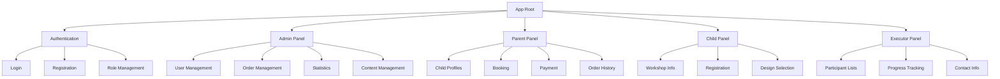
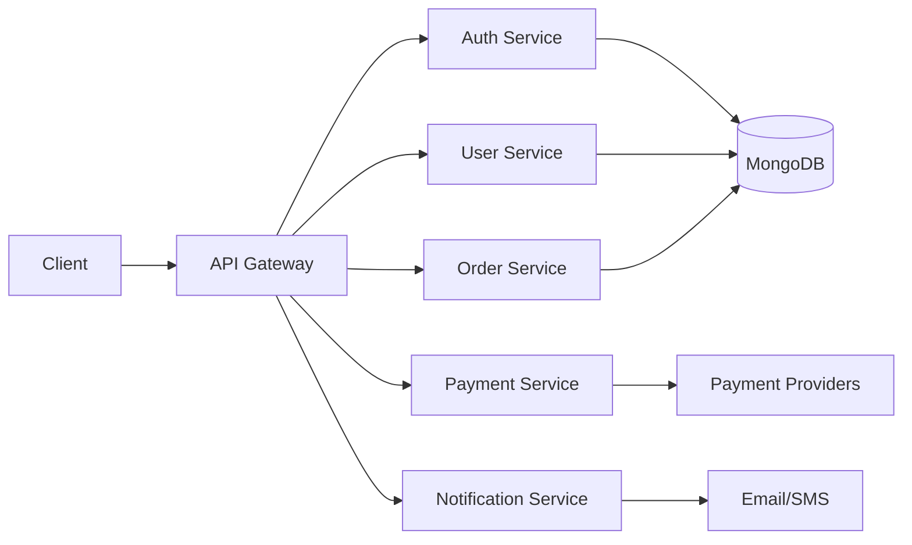
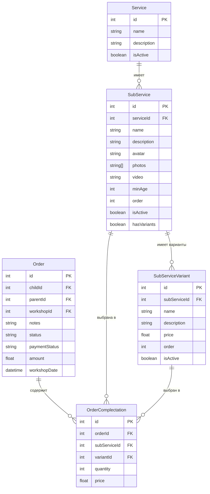
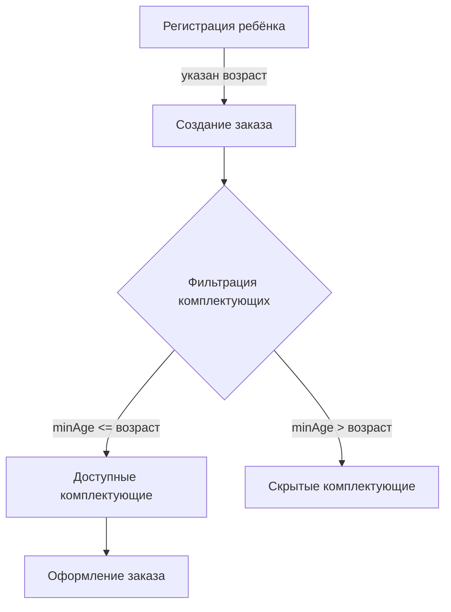

# Project.md - PWA-приложение "Восковые ручки"

## 1. Обзор проекта

### 1.1. Назначение
Progressive Web Application для организации мастер-классов по изготовлению восковых ручек в школах и детских садах.

### 1.2. Цели проекта
- Организация удаленной записи на мастер-классы
- Осуществление оплаты услуг
- Управление заказами и статистикой
- Обеспечение взаимодействия между организаторами, родителями и детьми

### 1.3. Целевая аудитория
- **Администраторы** - управление системой
- **Исполнители** - проведение мастер-классов
- **Родители** - запись детей и оплата
- **Дети** - просмотр информации и запись

## 2. Архитектура системы

### 2.1. Общая архитектура
```
┌─────────────────┐    ┌─────────────────┐    ┌─────────────────┐
│   Frontend      │    │    Backend      │    │   Database      │
│   (React PWA)   │◄──►│   (Node.js)     │◄──►│   (MongoDB)     │
└─────────────────┘    └─────────────────┘    └─────────────────┘
         │                       │                       │
         ▼                       ▼                       ▼
┌─────────────────┐    ┌─────────────────┐    ┌─────────────────┐
│   Payment       │    │   Email         │    │   File Storage  │
│   Systems       │    │   Service       │    │   (Images/Videos)│
└─────────────────┘    └─────────────────┘    └─────────────────┘
```

### 2.2. Компонентная архитектура Frontend



### 2.3. API архитектура Backend



## 3. Технологический стек

### 3.1. Frontend
- **Framework**: React.js 18+
- **State Management**: Redux Toolkit
- **UI Library**: Material-UI (MUI)
- **PWA**: Service Workers, Web App Manifest
- **Build Tool**: Vite
- **Language**: TypeScript

### 3.2. Backend
- **Runtime**: Node.js 18+
- **Framework**: Express.js
- **Database**: PostgreSQL
- **ORM**: Prisma/TypeORM
- **Authentication**: JWT + bcrypt
- **Language**: TypeScript

### 3.3. Инфраструктура
- **Hosting**: Российский VPS (VScale, Selectel)
- **SSL**: Let's Encrypt
- **CDN**: Cloudflare
- **Monitoring**: PM2 + Winston
- **Backup**: Automated PostgreSQL backups

### 3.4. Интеграции
- **Payment**: Сбербанк API, Тинькофф API
- **Email**: Nodemailer + SMTP
- **SMS**: SMS.ru API
- **Push Notifications**: Web Push API
- **File Storage**: AWS S3 / Local storage

## 4. Модели данных

### 4.1. User Model
```typescript
interface User {
  id: number;
  email: string;
  password: string;
  role: 'admin' | 'executor' | 'parent' | 'child';
  firstName: string;
  lastName: string;
  phone?: string;
  city?: string;
  school?: string;
  grade?: string;
  shift?: string;
  createdAt: Date;
  updatedAt: Date;
}
```

### 4.2. Order Model
```typescript
interface Order {
  id: number;
  childId: number;
  parentId: number;
  school: string;
  grade: string;
  shift: string;
  penType: 'regular' | 'double' | 'light';
  varnish: 'regular' | 'sparkle';
  stickers: string[];
  personalInscription?: string;
  status: 'pending' | 'paid' | 'completed' | 'cancelled';
  paymentStatus: 'pending' | 'paid' | 'refunded';
  amount: number;
  workshopDate: Date;
  createdAt: Date;
  updatedAt: Date;
}
```

### 4.3. Workshop Model
```typescript
interface Workshop {
  id: number;
  school: string;
  date: Date;
  shift: string;
  maxParticipants: number;
  currentParticipants: number;
  status: 'scheduled' | 'in-progress' | 'completed' | 'cancelled';
  executorId?: number;
  notes?: string;
  createdAt: Date;
  updatedAt: Date;
}
```

### 4.4. Chat Model
```typescript
interface Chat {
  id: number;
  parentId: number;
  adminId: number;
  messages: Message[];
  createdAt: Date;
  updatedAt: Date;
}

interface Message {
  id: number;
  senderId: number;
  content: string;
  timestamp: Date;
  isRead: boolean;
}
```

## Архитектура данных

### Основные модели

#### Service (Услуга)
- `id` - уникальный идентификатор
- `name` - название услуги
- `description` - описание услуги
- `isActive` - активна ли услуга
- `subServices` - связанные комплектации

#### SubService (Комплектация)
- `id` - уникальный идентификатор
- `serviceId` - ID связанной услуги
- `name` - название комплектации
- `description` - описание комплектации
- `avatar` - URL аватарки
- `photos` - массив URL фотографий
- `video` - URL видео
- `minAge` - минимальный возраст
- `order` - порядок отображения
- `isActive` - активна ли комплектация
- `hasVariants` - есть ли варианты комплектации
- `variants` - связанные варианты

#### SubServiceVariant (Вариант комплектации)
- `id` - уникальный идентификатор
- `subServiceId` - ID связанной комплектации
- `name` - название варианта (например: "Обычная", "Световая")
- `description` - описание варианта
- `price` - цена варианта
- `order` - порядок отображения
- `isActive` - активен ли вариант

#### Order (Заказ)
- `id` - уникальный идентификатор
- `childId` - ID ребенка
- `parentId` - ID родителя
- `workshopId` - ID мастер-класса
- `notes` - заметки к заказу
- `status` - статус заказа
- `paymentStatus` - статус оплаты
- `amount` - общая сумма
- `workshopDate` - дата мастер-класса
- `orderComplectations` - выбранные комплектации

#### OrderComplectation (Комплектация в заказе)
- `id` - уникальный идентификатор
- `orderId` - ID заказа
- `subServiceId` - ID комплектации
- `variantId` - ID выбранного варианта (опционально)
- `quantity` - количество
- `price` - цена выбранного варианта
- `subService` - связанная комплектация
- `variant` - выбранный вариант

### Диаграмма связей



## 5. Безопасность

### 5.1. Аутентификация и авторизация
- JWT токены с refresh механизмом
- Ролевая модель доступа (RBAC)
- Хеширование паролей (bcrypt)
- Rate limiting для API endpoints

### 5.2. Защита данных
- HTTPS/TLS шифрование
- Валидация входных данных
- SQL injection protection (Prisma/TypeORM)
- XSS protection
- CSRF protection

### 5.3. Соответствие требованиям
- 152-ФЗ (защита персональных данных)
- GDPR compliance (если применимо)
- Логирование действий пользователей

## 6. Производительность

### 6.1. Frontend оптимизация
- Code splitting и lazy loading
- Service Worker для кэширования
- Image optimization
- Bundle size optimization

### 6.2. Backend оптимизация
- Database indexing
- Query optimization
- Caching (Redis)
- Connection pooling
- Push notifications optimization

### 6.3. Мониторинг
- Performance metrics
- Error tracking
- User analytics
- Server health monitoring

## 7. Этапы разработки

### 7.1. Фаза 1: Базовая инфраструктура (2-3 недели)
- [ ] Настройка проекта и окружения
- [ ] Базовая архитектура Frontend/Backend
- [ ] Система аутентификации
- [ ] Базовые модели данных

### 7.2. Фаза 2: Основной функционал (4-5 недель)
- [ ] Регистрация и управление пользователями
- [ ] Система записи на мастер-классы
- [ ] Управление заказами
- [ ] Базовый интерфейс для всех ролей

### 7.3. Фаза 3: Платежи и уведомления (2-3 недели)
- [ ] Интеграция платежных систем
- [ ] Система уведомлений (Email + SMS + Push)
- [ ] Email/SMS интеграция
- [ ] Push notifications setup

### 7.4. Фаза 4: Дополнительный функционал (2-3 недели)
- [ ] Статистика и отчеты
- [ ] Экспорт данных
- [ ] Система чата между родителями и администраторами
- [ ] WebSocket интеграция для чата

### 7.5. Фаза 5: Тестирование и развертывание (2 недели)
- [ ] Функциональное тестирование
- [ ] Тестирование безопасности
- [ ] Развертывание на production
- [ ] Обучение пользователей

## 8. Стандарты разработки

### 8.1. Code Style
- ESLint + Prettier
- TypeScript strict mode
- Conventional Commits
- Pre-commit hooks

### 8.2. Тестирование
- Unit tests (Jest)
- Integration tests
- E2E tests (Playwright)
- Code coverage > 80%

### 8.3. Документация
- API documentation (Swagger)
- Component documentation (Storybook)
- README для каждого модуля
- Deployment guides

## 9. Мониторинг и поддержка

### 9.1. Логирование
- Structured logging (Winston)
- Error tracking (Sentry)
- Performance monitoring
- User behavior analytics

### 9.2. Backup и восстановление
- Daily database backups
- Automated backup testing
- Disaster recovery plan
- Data retention policies

### 9.3. Обновления и поддержка
- Automated deployments
- Feature flags
- A/B testing capabilities
- Rollback procedures

## 10. Метрики успеха

### 10.1. Технические метрики
- Page load time < 3s
- API response time < 500ms
- 99.9% uptime
- Zero critical security vulnerabilities

### 10.2. Бизнес метрики
- Увеличение количества записей на 50%
- Сокращение времени обработки заказов на 30%
- Удовлетворенность пользователей > 4.5/5
- Снижение количества ошибок на 80%

## Бизнес-логика: возрастные ограничения для комплектующих

### Регистрация ребёнка
- При регистрации ребёнка обязательно указывается возраст (целое число, лет).
- Валидация возраста реализуется на фронте и бэке.

### Комплектующие (SubService)
- В сущности комплектующего добавлено поле `minAge` (минимальный возраст, с которого доступно данное комплектующее).
- minAge указывается при создании/редактировании комплектующего в интерфейсе администратора.

### Формирование заказа
- При выборе комплектующих для заказа отображаются только те, у которых `minAge <= возраст ребёнка`.
- (Опционально) При попытке создать заказ с комплектующим, не подходящим по возрасту, backend возвращает ошибку.

### Схема взаимодействия (Mermaid)


### API и интерфейсы
- В API регистрации ребёнка добавлено поле `age` (number, required)
- В API комплектующих добавлено поле `minAge` (number, default: 0)
- В API заказа фильтрация комплектующих по возрасту ребёнка

### Пример структуры данных
```json
{
  "child": {
    "name": "Иван",
    "age": 6
  },
  "subService": {
    "name": "Двойные ручки",
    "minAge": 5
  }
}
```

### Правила
- Комплектующие с minAge > возраста ребёнка не отображаются при выборе.
- minAge = 0 — комплектующее доступно для любого возраста.
- Все проверки возраста дублируются на фронте и бэке для надёжности.

---

**Версия документа**: 1.0  
**Дата создания**: 2024-07-06  
**Последнее обновление**: 2024-07-06  
**Ответственный**: Системный архитектор 